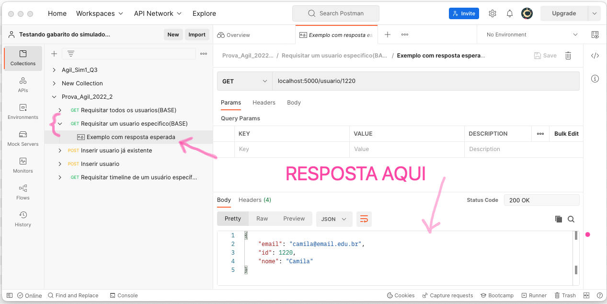

# 3. Questão sobre Flask e BD 
**(2 pontos)**

Neste exercício vamos definir rotas e endpoints para tentar trabalhar com a classe `User` de maneira mais próxima a REST. Não será necessário usar Flask RESTFul mas sim usar rotas, argumetnos, valores de retorno e métodos HTTP corretamente. 

Dica: [Pode ser útil rever este exemplo de banco de dados visto no hands-on em aula](https://github.com/Tiagoeem/ProjAgil_hands-on_Finais_2022/blob/main/semana_5/src/app.py). Você também pode consultar qualquer documentação na internet. 

Este item não conta com testes unitários, mas o arquivo de collection *Postman* [Prova_Agil_2022_2.postman_collection.json](./src/test/para_postman/Prova_Agil_2022_2.postman_collection.json) tem exemplos de requests e qual a resposta adequada.

Você deverá trabalhar no arquivo [app.py](./src/app.py).  

O que deve ser feito: 

Olhando o arquivo `app.py` fornecido analises a rotas `/usuario` com método `GET` e `usuario/<int:user_id>/timeline`>.

## 3.1 Leitura de Usuário
**(1 ponto)**

Crie uma rota  para leitura de um único usuário da base. Esta tarefa envolve usar uma annotation `@app.route` correta e também escrever uma função que recebe os valores coerentes com a rota. A função pode ter qualquer nome que você queira desde que a rota seja correta. 

Você deve seguir o padrão das demais rotas `/usuario` e adotar um verbo HTTP adequado. Esta rota vai receber um ID de usuário e deve retornar um dicionário contendo como chaves `id`, `nome` e `email` do objeto.

Caso não haja na base SQL um usuário com o `id` solicitado deve-se retornar um dicionário como abaixo: 

```python
{'Erro': 'Usuário não Encontrado'}
```

Retorne sempre os *status codes* HTTP adequados. 


## 3.2 Inserção de novo User na base SQL 
**(1 ponto)**

Crie uma rota  para inserir um usuário na base. Esta tarefa envolve usar uma annotation `@app.route` correta e também escrever uma função que recebe os valores coerentes com a rota.   A função pode ter qualquer nome que você queira desde que a rota seja correta. 

O `id` do usuário será passado na rota, mas `nome` e `email` vão precisar usar algum recurso de HTTP. 

## Como estudar o exemplo dado 

O arquivo [Prova_Agil_2022_2.postman_collection.json](./src/test/para_postman/Prova_Agil_2022_2.postman_collection.json)  tem uma collection de requests HTTP feitos com o postman.

Para estudar você pode: 

Executar o app.py no Flask, que deverá subir um servidor no [http://localhost:5000](http://localhost:5000)

Dentro do Postman, escolher Import no menu da esquerda

No menu de Import escolher *Upload Files* 

Navegar até o arquivo `Prova_Agil_2022_2.postman_collection.json`

Uma vez seguidos os passos acima, aparecerá uma imagem parecida com a que vem a seguir.  Nela podemos ver os *endpoints* e nos detalhes os verbos HTTP e também exemplos de respostas esperadas.




[Home](./README.md)
[Q1](./Q1.md)
[Q2](./Q2.md)
[Q3](./Q3.md)


