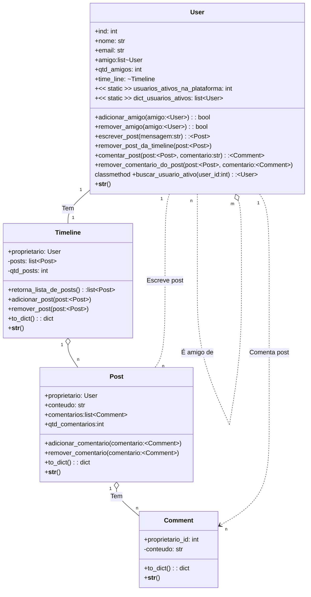

# Classes usadas nas Questões

## Explicação 

Tratam-se de objetos para uma rede social simples. Estas classes estão detalhadas no arquivo rede_social.py. 

Basicamente cada `User` tem uma `Timeline` em que vai publicando objetos do tipo `Post`

Um `User` adiciona outros como amigos. Um usuário pode ter de $0$ a $n$ amigos. 

Os *posts* podem receber comentários do próprio `User` ou de seus amigos. 

O próprio `User` ou seus amigos podem fazer comentários em seus posts. O arquivo de testes  ``src/test/test_tdd_prova.py` tem alguns exemplos de uso dos objetos deste modelo. 
