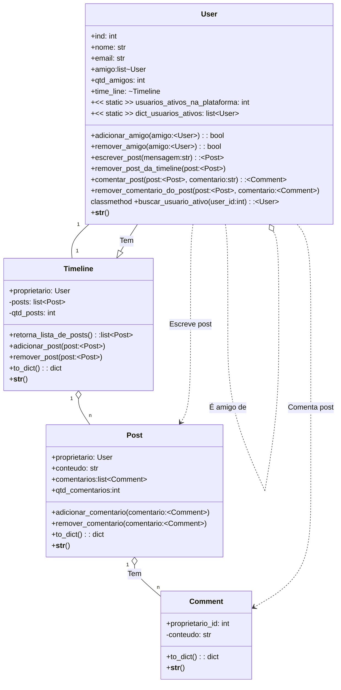

# Classes usadas nas Questões

```mermaid

classDiagram
class User {
+ind: int
+nome: str
+email: str
+amigo:list~User
+qtd_amigos: int
+time_line: ~Timeline
+<< static >> usuarios_ativos_na_plataforma: int
+<< static >> dict_usuarios_ativos: list~User~
+adicionar_amigo(amigo:~User~): bool
+remover_amigo(amigo:~User~): bool
+escrever_post(mensagem:str):~Post~
+remover_post_da_timeline(post:~Post~)
+comentar_post(post:~Post~, comentario:str):~Comment~
+remover_comentario_do_post(post:~Post~, comentario:~Comment~)
classmethod +buscar_usuario_ativo(user_id:int):~User~
+__str__()
}
class Timeline {
+proprietario: User
-posts: list~Post~
-qtd_posts: int 
+retorna_lista_de_posts():list~Post~
+adicionar_post(post:~Post~)
+remover_post(post:~Post~)
+to_dict(): dict
+__str__()
}
class Post {
+proprietario: User
+conteudo: str
+comentarios:list~Comment~
+qtd_comentarios:int
+adicionar_comentario(comentario:~Comment~)
+remover_comentario(comentario:~Comment~)
+to_dict(): dict
+__str__()
}
class Comment {
+proprietario_id: int
-conteudo: str
+to_dict(): dict
+__str__()
}
User "1" -- "1" Timeline 
Timeline "1" o-- "n" Post
Post "1" o-- "n" Comment : Tem
User --|> Timeline : Tem
User ..> Post : Escreve post
User ..> Comment : Comenta post
User ..o User : É amigo de 


```

